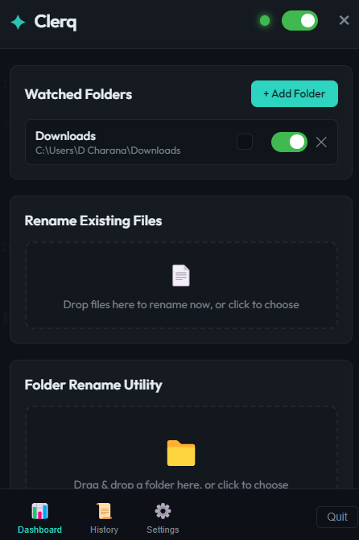
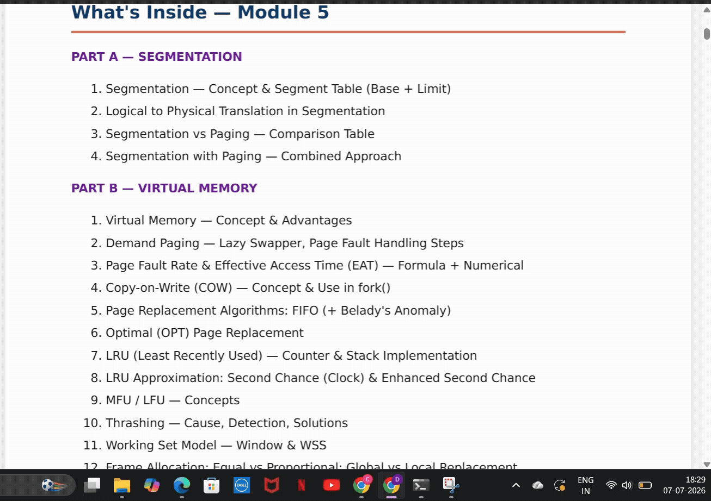

# Clerq

> **An AI-powered desktop file and folder organizer that automatically generates meaningful names using Large Language Models.**

---

<p align="center">
  
</p>

<p align="center">
  
</p>

---

## Description

Clerq is an AI-powered desktop utility built with Electron that continuously monitors selected folders and intelligently renames newly added files using Large Language Models. Instead of generic filenames such as **IMG_0042.jpg**, **Document (3).pdf**, or **Scan_2026_07.pdf**, Clerq analyzes document contents or metadata and automatically generates clean, descriptive, human-readable filenames.

The application supports multiple AI providers including **Google Gemini**, **OpenAI**, **Anthropic Claude**, and **Ollama** for completely offline local inference. Alongside automatic folder monitoring, Clerq also offers manual file and folder renaming, configurable blacklist rules, duplicate handling, undo functionality, rename history, customizable notifications, and a lightweight system tray interface designed to run quietly in the background.

---

# Getting Started

## Dependencies

Before installing Clerq, ensure your system meets the following requirements:

- Windows 10 / Windows 11
- Node.js (v18 or later recommended)
- npm (bundled with Node.js)
- Internet connection (required for Gemini, OpenAI, or Claude)
- Ollama installed locally (optional for offline AI inference)

### Libraries Used

- Electron
- Chokidar
- Node.js File System (fs)
- Electron IPC
- Crypto (SHA-256)
- Path
- Google Gemini API
- OpenAI API
- Anthropic Claude API
- Ollama API

---

## Installing

### Clone the repository

```bash
git clone https://github.com/charanadonuru/clerq.git
```

### Navigate into the project

```bash
cd clerq
```

### Install dependencies

```bash
npm install
```

### Configure an AI Provider

Open Clerq and configure one of the supported providers:

- Google Gemini API Key
- OpenAI API Key
- Anthropic Claude API Key

or

Install **Ollama** locally and select one of your installed local models for completely offline AI-powered renaming.

No additional project modifications are required.

---

## Executing Program

### Run Clerq

```bash
npm start
```

### Build the application

```bash
npm run build
```

### Typical Workflow

1. Launch Clerq.
2. Add one or more folders to monitor.
3. Select your preferred AI provider.
4. Configure rename preferences.
5. Download or move files into a watched folder.
6. Clerq automatically extracts the content, generates an AI-powered filename, and renames the file.
7. View rename history or undo any previous rename whenever needed.

---

# Help

### AI connection failed

- Verify your API key.
- Check your internet connection.
- Ensure the selected model exists.
- Use **Test Connection** inside Settings.

### Ollama is not responding

Ensure Ollama is running.

Example:

```bash
ollama serve
```

Check installed models:

```bash
ollama list
```

### Files are not being renamed

Verify that:

- Folder watching is enabled.
- The Master Switch is enabled.
- The file type is enabled.
- The file is not inside a blacklisted folder.
- The filename is not blacklisted.
- The file does not exceed the configured maximum size.
- The file is fully downloaded before processing.

### Watcher stopped unexpectedly

Remove the watched folder and add it again, or restart Clerq.

---

# Authors

**Donuru Charana Reddy**

- GitHub: https://github.com/charanadonuru

---
# License

This project is licensed under the **MIT License**.

See the **LICENSE** file for more information.
